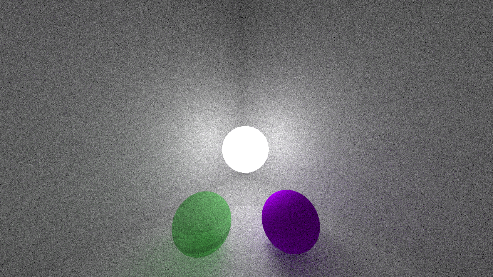
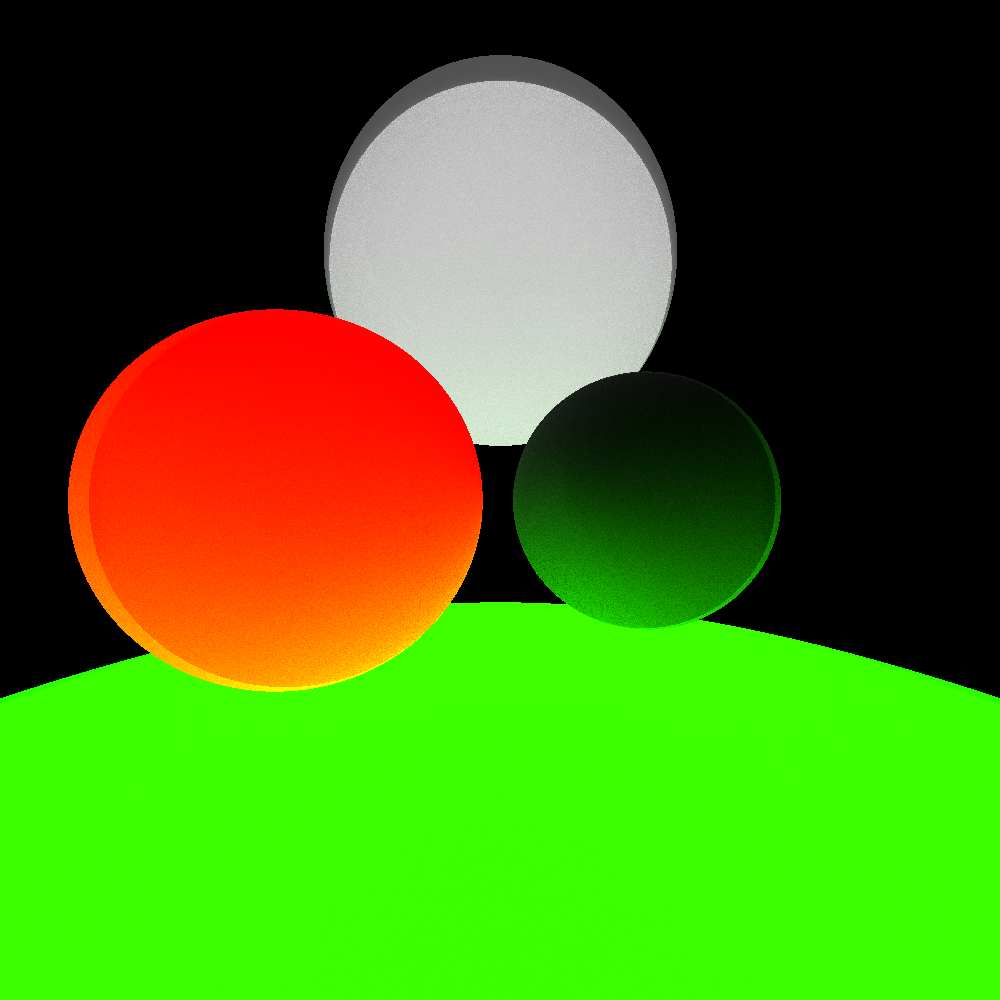
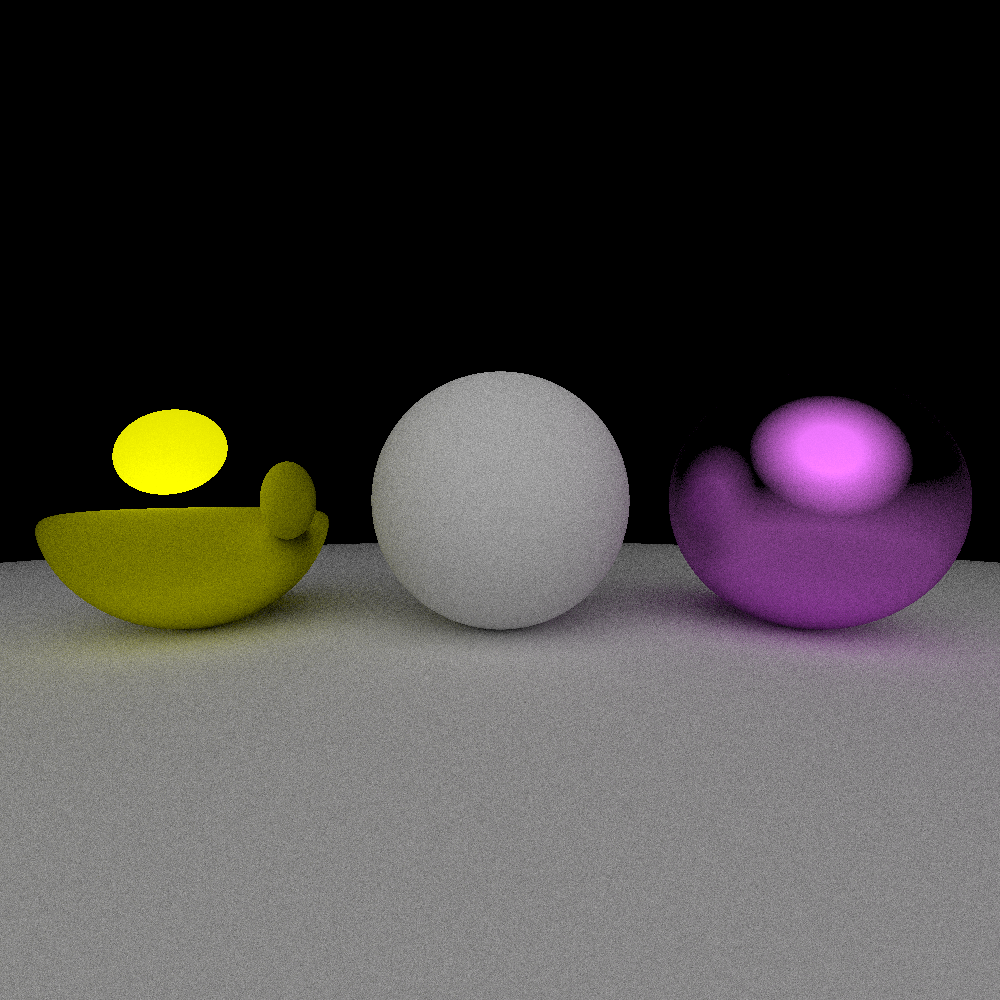

# Physically based ray tracer in Rust
Multi-threaded raytracer built for exploration of physically based rendering (PBR), linear algebra and Rust dynamic dispatch via trait objects for extensible geometries.

*Features:*
- *Geometry:* Spheres and AABB (Axis Aligned Bounding Boxes)
- *Materials:*
    - Emissive with color blending
    - Metallic with variable roughness
    - Transparent materials
- *Scene creation*
- *Anti-Aliasing* 

# Gallery
## Transparent spheres and anti-aliasing



## Emmisive Cubes with light blending


## Emmisive spheres


## Metalic materials with roughness


# Usage
All rendered scenes from gallery are included in `main.rs` file. Default file output is `output.png`. To run and render selected scene:
```bash
git clone https://github.com/Eg-Nickname/cpu-ray-tracer
cd cpu-ray-tracer
# Run with release for optimal performence
cargo run --release
```

# Author

**Jakub Kurek**